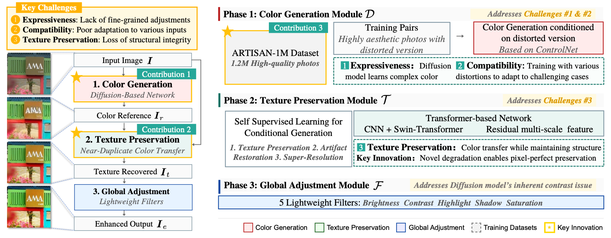

# GenColor: Generative and Expressive Color Enhancement with Pixel-Perfect Texture Preservation
Official PyTorch Implementation of NeurIPS 2025 (Spotlight) Paper "[GenColor: Generative and Expressive Color Enhancement with Pixel-Perfect Texture Preservation](https://openreview.net/pdf?id=n8AvXKcCeR)"




Code is Coming Soon...

# Citation
You can cite it as follows:

```
@inproceedings{donggencolor,
  title={GenColor: Generative and Expressive Color Enhancement with Pixel-Perfect Texture Preservation},
  author={Dong, Yi and Wang, Yuxi and Lin, Xianhui and Ouyang, Wenqi and Shen, Zhiqi and Ren, Peiran and Fan, Ruoxi and Lau, Rynson WH},
  booktitle={The Thirty-ninth Annual Conference on Neural Information Processing Systems}
}
```